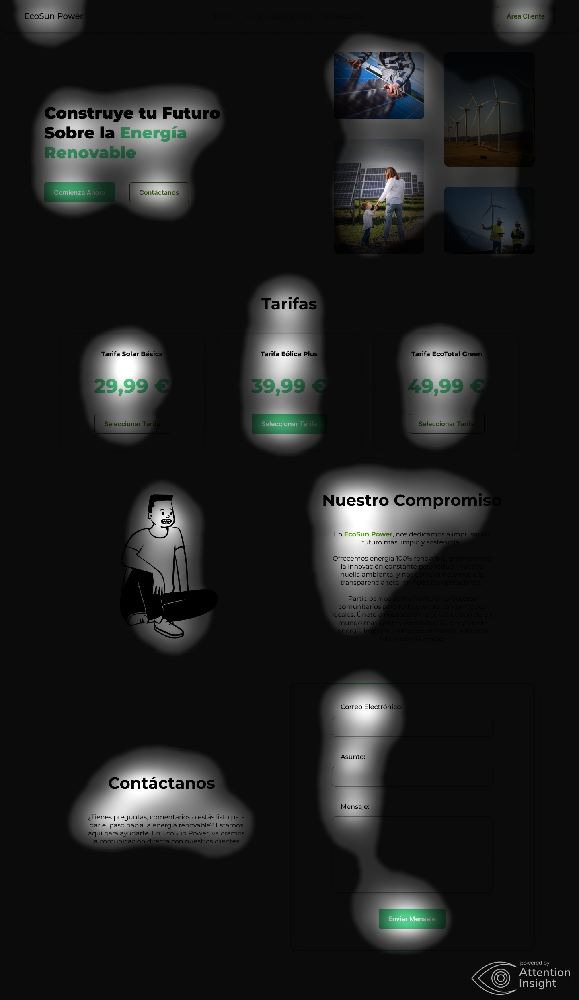

# PROYECTO LENGUAJE DE MARCAS

## ¿Cómo iniciar el proyecto?

Teniendo PHP 8.2 instalado en el ordenador, lanzar el siguiente comando en la consola (Por defecto escucha por el puerto 8000):

```bash
php -S 127.0.0.1:8000
```

## Estructura del Proyecto
```bash
.
├── api => "Contiene los archivos relacionados con la lógica de la API"
│   └── database => "Almacena la base de datos SQLite"
├── assets => "Archivos estáticos proporcionados por Metronic"
├── components => "Contiene los componentes que se mostrarán en la página de inicio"
├── css => "Contiene los estilos personalizados de la aplicación"
├── images => "Contiene todas las imágenes usadas en la aplicación"
└── scripts => "Contiene la lógica general de la web"
```

## API
Para poder utilizar la API todas las peticiones se harán al endpoint:
```bash
{WEB_URL}/api/endpoint.php?controller={ACTION}
```
\
Los controladores disponibles son los siguientes:

| Controller | Method   | Parameters                                                   | Return                                                                                   |
|------------|----------|--------------------------------------------------------------|------------------------------------------------------------------------------------------|
| client     | **GET**  |                                                              | Un objeto JSON con las propiedades del usuario que esté iniciado sesión en la plataforma |
| logout     | **GET**  |                                                              | `Nota:` Redirige al usuario a la página principal                                        |
| client     | **POST** | `name`, `surname`, `email`, `dni`, `password`, `energy_plan` | Un objeto JSON que contiene el nombre de usuario si la operación se realizó con éxito    |
| login      | **POST** | `username`, `password`                                       | Un objeto JSON que indica si el usuario pudo o no iniciar sesión en la aplicación        |

>**Nota**: Cuando se requiere enviar la contraseña al backend es necesario enviar la contraseña ya encriptada desde la aplicación, de esta manera no se expone la información al hacer el intercambio de datos entre el backend y el frontend.

### Ejemplo de uso
Ejemplo de uso de la API utilizando la librería `JQuery`:
```js
$.ajax({
    url: '/api/endpoint.php?controller=client',
    type: 'GET',
    dataType: 'json',
    success: function(response) {
        // Manejar la respuesta JSON aquí
    },
    error: function(xhr, status, error) {
        // Manejar errores aquí
    }
});
```

## Inicio de Sesión
Para poder acceder al área de clientes puedes usar las siguientes credenciales:

```bash
Usuario: "9e9ec5e6"
Contraseña: "Pepe2024!"
```

```bash
Usuario: "b3c9f843"
Contraseña: "Pruebas2024!"
```

## Registro
También se puede registrar en la aplicación para crear su propio usuario, para ello completar el formulario de la
pantalla de registro. Una vez se registre, se le mostrará una alerta mostrándole su usuario.
>**Importante**: Guarde el usuario, ya que no podrá volver a obtenerlo.

# Documentación del Diseño
Al obtener los requerimientos que debía satisfacer la página web, opté por diseñar una **landing page**, ya que tiene como objetivo convertir los visitantes en clientes. A diferencia de una página de inicio convencional, una landing page proporciona una experiencia limpia y sin distracciones, con un enfoque claro en los **CTA (Calls to Action)** para motivar a los usuarios a hacer la acción prediseñada (En este caso convertirlos en clientes).

## CTA
Opté por usar únicamente dos llamadas a la acción, una de ellas es la llamada a la acción principal cuyo propósito es convertir los visitantes de la página web en nuevos clientes. La segunda llamada a la acción queda en segundo plano, pero complementa a la perfección la CTA principal, generando en los usuarios una confianza extra.
Cada uno tiene el siguiente propósito:

1. **CTA Principal**: Tiene como objetivo convertir a los visitantes de la página web en nuevos clientes. Su pequeño, claro y directo mensaje impulsa la acción de contratar una tarifa energética. Elementos:
    *  Botón primario con el texto: "Comienza Ahora"
    *  Botón primario con el texto: "Contratar Tarifa"
2. **CTA Secundario**: Aunque está llamada a la acción se encuentre en segundo plano, la diseñé para poder brindar una confianza adicional a los nuevos usuarios y reforzar su decisión de convertirse en clientes. Elementos:
    *  Botón secundario con el texto: "Contáctanos"
    *  Botón secundario con el texto: "Mostrar Detalles"
    *  Botón primario con el texto: "Enviar Mensaje"

## Validando el diseño
Para validar el diseño y garantizar que nuestros Calls to Action (CTA) generen el efecto deseado, utilizaremos un plugin de Figma que nos permitirá generar mapas de calor. 
Estos mapas de calor son una herramienta indispensable en la evaluación de la efectividad del diseño realizado.
Los mapas de calor visualizan las áreas de una página web donde los usuarios hacen clic, tocan o pasan más tiempo. 
Estos datos se representan mediante colores, donde las áreas más "calientes" (con mayor actividad por parte de los usuarios) se muestran en tonos más rojizos, mientras que las áreas menos activas se muestran en tonos más verdosos.

Si analizamos el mapa de calor, podemos identificar de manera visual que elementos de la página están recibiendo más atención y cuáles están siendo más ignorados.
Gracias a esto, podremos medir nuestra efectividad de los CTA. 

Usualmente, estos mapas de calor se suelen hacer analizando las acciones de usuarios reales, pero podemos ahorrarnos ese paso gracias a este plugin.
Ya que trabaja con inteligencia artificial y puede simular como actuarían usuarios reales.

Justo debajo podemos apreciar el mapa de calor que ha generado basándose en el diseño de mi página web:


Como podemos apreciar el 66% de los CTA serían abarcados por zonas de gran actividad por parte del usuario. 
Cabe recalcar que en los mapas de calor no es solo importante que el usuario se fije en los CTA, también tiene
que pararse en los gráficos que apoyan el mensaje principal de la página (Como en este caso, que la galería de imágenes es una zona caliente).

Este mismo plugin de Figma nos permite generar el **Focus Map** que es una herramienta complementaria al mapa de calor que ofrece
las áreas de la página donde los usuarios pasan más tiempo visualizando. La diferencia principal entre el Focus Map y el mapa de calor es que el Focus Map se centra específicamente en el comportamiento visual del usuario, mostrando qué áreas de la página atraen más la atención y el interés de los usuarios en términos de tiempo de visualización.

Si aplicamos el Focus Map a mi landing page:


### Conclusión
Como podemos apreciar, tanto en el mapa de calor como en el Focus Map, he conseguido que se centre la atención del usuario
en los puntos críticos de conversión (Pasar de visitante a cliente). Gracias a Figma, el diseño y validación de una página web
es una tarea más sencilla para gente que no se dedica profesionalmente al diseño UI/UX.